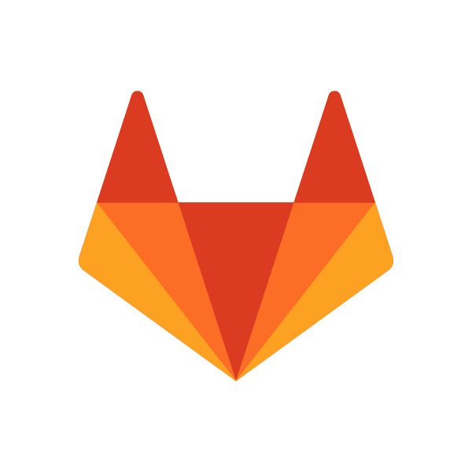

<h1 align="center">Hi there! 👋 I'm Omkar Bhujbal</h1>
<h3 align="center">A passionate and innovative DevOps Engineer</h3>

- 🚀 Always striving for excellence in the world of DevOps
- 💡 Transforming ideas into scalable and automated solutions
- 👯 I’m actively seeking collaboration on exciting DevOps OpenSource Projects
- 💬 Let's discuss fascinating topics like AWS, K8s, Python Automation, and Open Source initiatives
- 👨‍💻 Explore my diverse range of projects on [GitHub](https://github.com/vegito11?tab=repositories)

- 📫 How to reach me **omkardbhujbal@gmail.com**

-------------------

 

<h2> Connect with me </h2>

 

 

<table style="width:100%">
  <tr>
    <th><h2> Skills </h2> </th>
  </tr>
  <tr>
    <td> <h2> Cloud <h2> </td>
    <td>
       &nbsp;&nbsp;&nbsp;&nbsp;
      
    </td>
  </tr>
  <tr>
    <td> <h2> Container <h2> </td>
    <td>
       &nbsp;&nbsp;&nbsp;&nbsp;
      
    </td>
  </tr>
  <tr>
    <td> <h2> CICD </h2> </td>
    <td>
       &nbsp;&nbsp;&nbsp;&nbsp;
       &nbsp;&nbsp;&nbsp;&nbsp;
       &nbsp;&nbsp;&nbsp;&nbsp;
       &nbsp;&nbsp;&nbsp;&nbsp;          
       &nbsp;&nbsp;&nbsp;&nbsp;          
    </td>
  </tr>
  <tr>
    <td> <h3> Configuration <h3>   </td>
    <td>
       &nbsp;&nbsp;&nbsp;&nbsp;
       &nbsp;&nbsp;&nbsp;&nbsp;
    </td>
  </tr>
  <tr>
    <td> <h2> IAC and Security </h2> </td>
    <td>
       &nbsp;&nbsp;&nbsp;&nbsp;
       &nbsp;&nbsp;&nbsp;&nbsp;
       &nbsp;&nbsp;&nbsp;&nbsp;
    </td>
  </tr>
  <tr>
    <td> <h2> Monitoring </h2> </td>
    <td>
       &nbsp;&nbsp;&nbsp;&nbsp;
       &nbsp;&nbsp;&nbsp;&nbsp;
       &nbsp;&nbsp;&nbsp;&nbsp;
       &nbsp;&nbsp;&nbsp;&nbsp;
       &nbsp;&nbsp;&nbsp;&nbsp;
    </td>
  </tr>
  <tr>
    <td> <h2> Language </h2> </td>
    <td>
       &nbsp;&nbsp;&nbsp;&nbsp;
       &nbsp;&nbsp;&nbsp;&nbsp;
       &nbsp;&nbsp;&nbsp;&nbsp;
       &nbsp;&nbsp;&nbsp;&nbsp;
       &nbsp;&nbsp;&nbsp;&nbsp;
    </td>
  </tr>
  <tr>
    <td> <h2> Logging </h2> </td>
    <td>
       &nbsp;&nbsp;&nbsp;&nbsp;
       &nbsp;&nbsp;&nbsp;&nbsp;
       &nbsp;&nbsp;&nbsp;&nbsp;
       &nbsp;&nbsp;&nbsp;&nbsp;
    </td>
  </tr>
  <tr>
    <td> <h2> OS </h2> </td>
    <td>
       &nbsp;&nbsp;&nbsp;&nbsp;
       &nbsp;&nbsp;&nbsp;&nbsp;
       &nbsp;&nbsp;&nbsp;&nbsp;
    </td>
  </tr>
  <tr>
    <td> <h2> Plugins </h2> </td>
    <td>
      <ul>
        <li> <h2> YQ  </h2> &nbsp;&nbsp;&nbsp;&nbsp;</li>
        <li> <h2> JQ  </h2> &nbsp;&nbsp;&nbsp;&nbsp;</li>
        <li> <h2> Helm S3, Secret, Diff  </h2> &nbsp;&nbsp;&nbsp;&nbsp;</li>
        <li> <h2> Helm S3, Secret, Diff  </h2> &nbsp;&nbsp;&nbsp;&nbsp;</li>
      </ul>
    </td>
  </tr>

</table>

  

   

  
    

